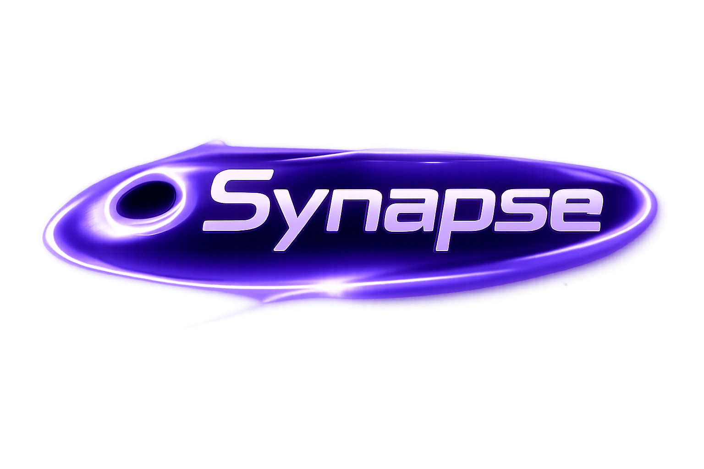

<p align="center">
  
</p>

<h1 align="center">Synapse</h1>

<p align="center">
  AI 漫剧创作平台：从小说、分镜、角色画面到视频合成的一体化桌面工作台。
</p>

<p align="center">
  
  
  
  
</p>

## 项目状态

Synapse 的源码公开用于学习、审阅和二次开发参考。软件正式运行需要有效卡密。

获取卡密、商业授权或定制开发请联系：

**PhineasGym@outlook.com**

说明：本仓库是 source-available 项目，不是允许任意商业分发、去授权重打包或转售的自由开源许可证项目。

## 功能亮点

- 剧情整理：围绕小说/短剧内容拆解创作素材。
- 角色管理：维护角色设定、参考图和一致性提示词。
- AI 分镜：生成镜头级提示词、动作描述、首尾帧规划。
- 图像生成：对接图像模型生成关键画面。
- 视频生成：对接视频模型生成片段。
- 视频合成：基于 FFmpeg 拼接、转场、导出最终成片。
- 项目管理：按项目保存素材、配置、帧图和视频结果。
- 桌面发布：支持 PyInstaller 打包和 Inno Setup 安装包。

## 界面预览

如果你要在 GitHub 首页展示更直观的效果，可以把脱敏后的界面截图放到 `docs/screenshots/`，再在这里引用。

```text
docs/screenshots/home.png
docs/screenshots/workspace.png
docs/screenshots/settings.png
```

## 快速开始

### 1. 准备环境

建议使用 Windows。

```powershell
python --version
```

推荐 Python 3.11 或更高版本。

### 2. 安装依赖

```powershell
pip install -r requirements.txt
```

### 3. 准备 FFmpeg

任选一种方式：

- 把 `ffmpeg.exe` 放到 `tools\ffmpeg.exe`
- 或者把 FFmpeg 加入系统 PATH

`tools/` 默认不会提交到 GitHub，避免把大型二进制文件塞进源码仓库。

### 4. 创建本地配置

```powershell
Copy-Item .\user_config.example.json .\user_config.json
```

然后在软件设置页填入你自己的模型 API Key。

### 5. 启动开发版

```powershell
python .\main.py
```

没有有效卡密时，软件会停留在授权激活界面。

## 生成安装包

Synapse 使用 PyInstaller + Inno Setup 生成 Windows 安装包。

```powershell
python .\build_installer.py
```

生成结果：

```text
installer_output\Synapse_Setup_v1.0.0.exe
```

安装包支持：

- 选择安装路径
- 创建桌面快捷方式
- 创建开始菜单入口
- 正常卸载

## 仓库结构

```text
Synapse/
├─ api_server.py              # 本地 FastAPI 服务
├─ main.py                    # 桌面端入口
├─ config.py                  # 配置与路径管理
├─ license_client.py          # 授权验证与本地加密缓存
├─ llm_engine.py              # 文本模型调用
├─ image_engine.py            # 图像模型调用
├─ video_engine.py            # 视频模型调用
├─ ffmpeg_utils.py            # 视频处理工具
├─ project_manager.py         # 项目文件管理
├─ task_queue.py              # 后台任务队列
├─ static/                    # 前端页面与资源
├─ prompt_templates/          # 提示词模板
├─ installer.iss              # Inno Setup 安装脚本
└─ user_config.example.json   # 脱敏配置样例
```

## 不提交的内容

以下内容包含本地状态、敏感配置、用户项目数据或构建产物，默认不会提交：

- `user_config.json`
- `license_cache.json`
- `projects/`
- `dist/`
- `build/`
- `installer_output/`
- `release/`
- `tools/`
- 本地截图和自动化临时文件

请不要提交真实 API Key、卡密、用户项目数据或安装包产物。

## 授权与使用限制

源码公开不代表放弃授权管理。

未获得作者书面许可前，不得：

- 去除、绕过或破坏卡密激活机制
- 将去授权版本重新发布
- 商业转售、租赁、打包分发本软件
- 冒充原作者发布派生版本

完整条款见 [LICENSE](LICENSE)。

## 联系作者

卡密、商业授权、定制开发：

**PhineasGym@outlook.com**
